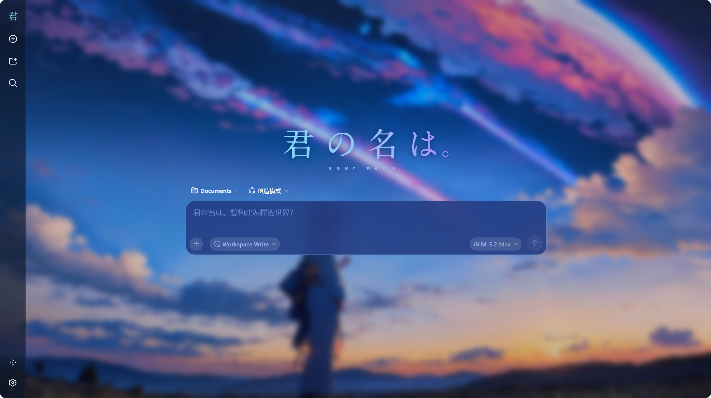
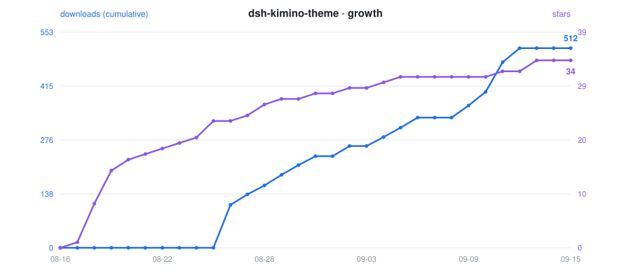

# dsh-kimino-theme · Kimi no Na wa Theme

[中文](README.md) | English

<p align="center">
  
</p>

<p align="center">
  
  &nbsp;
  
  &nbsp;
  
  &nbsp;
  <a href="https://awesome-dsh-plugin.com"></a>
</p>

<p align="center">
  <strong>A Kimi no Na wa (Your Name) theme for the DeepSeek Harness (DSH) Web GUI</strong><br>
  <em>Comet-blue glassmorphism · cinematic wallpaper · logo swap · composer re-skin · unified scrollbars · one-command install</em>
</p>

<div align="center">

[What it is](#what-it-is) · [Theme details](#theme-details) · [Quick start](#quick-start) · [Customizing](#customizing) · [FAQ](#faq) · [Known limitations](#known-limitations) · [License](#license-and-asset-copyright)

</div>

## What it is

dsh-kimino-theme turns the DSH Web GUI into Makoto Shinkai's *Your Name.*: a cinematic wallpaper behind every surface, translucent frosted-glass panels, comet-blue (`#93C5FD`) as the single interaction color, the movie logo in place of the DSH brand, a navy-glass composer card, and the placeholder copy swapped for themed lines.

It is a standard dsh plugin package: one `dsh plugin` command installs it into a profile, it persists across DSH restarts, and it modifies no DSH source; removing it fully reverts the page.

| Dimension | Native dsh web | dsh-kimino-theme |
| --- | --- | --- |
| Background | Solid / solid gradient | Cinematic wallpaper + global blur veil |
| Surfaces | Opaque layers | Translucent frosted glass (backdrop-filter) |
| Branding | DSH default | Movie logo (expanded + collapsed marks) |
| Composer | Default styling | Navy glass card, themed placeholders |
| Scrollbars | Default | Global blue-glass thin scrollbars |
| Message list bottom | Hard edge | 40px gradient fade-out mask |
| Install | — | One `dsh plugin --profile web add ...` command |
| Revert | — | Remove fully reverts the page |

<p align="center">
  
</p>

## Theme details

### Comet-blue glassmorphism

The theme layers roughly 60 design-token overrides through the official `theme.overrideTokens` API: backgrounds become translucent (revealing the wallpaper), borders turn low-saturation blue, interaction states (hover/active/selected) unify around comet blue, and status colors are tuned for dark glass. Light and dark modes share one visual — glass over a wallpaper does not need a light variant. The full token list lives in [docs/theme-tokens.md](docs/theme-tokens.md) (Chinese).

### Wallpaper and logos

- The wallpaper is served by the host half at `/kimino-bg/current.jpg` (`assets/current.jpg` inside the package), with a subtle dark gradient overlay for text legibility;
- The expanded sidebar shows the horizontal movie logo; the collapsed rail shows a letter mark (two SVGs, also plugin-served);
- The hero headline is replaced with a large centered logo.

<p align="center">
  
  
</p>

### Composer and placeholder copy

The composer card is redrawn as a navy glass capsule; placeholders swap automatically per UI language:

| UI language | Message input | New-session prompt |
| --- | --- | --- |
| Chinese | `黄昏之时，我在这里等你。` | `君の名は。想构建怎样的世界？` |
| English | `黄昏の時、私はここにいるよ。` | `君の名は。どんな世界を構築する？` |

### Message scrolling and gradient mask

The last 40px of the message list fades out smoothly with zero clipping on the composer; the "scroll to bottom" button works under the inner scroller.

### Unified scrollbars

Global scrollbars adopt the blue-glass style across mainstream browsers.

## Quick start

> **Browser recommendation**: the theme leans heavily on backdrop-filter glass, custom scrollbars and CSS masks — **Microsoft Edge** or **Google Chrome** recommended; Firefox renders some of these effects inconsistently (scrollbars, gradient masks may degrade).

### Requirements

- DeepSeek Harness installed and `dsh web` working;
- pnpm available on the machine (`dsh plugin` uses it internally; the Node.js-bundled corepack can provide it).

### Install

```sh
dsh plugin --profile web add dsh-kimino-theme
dsh web   # restart DSH to apply
```

Or install straight from GitHub:

```sh
dsh plugin --profile web add github:niiang/dsh-kimino-theme
```

The wallpaper appearing and the sidebar logo changing confirm the install. The theme then persists across DSH restarts.

### Update

```sh
dsh plugin --profile web update dsh-kimino-theme
dsh web   # restart to apply
```

### Disable temporarily (without uninstalling)

Edit `~/.dsh/profiles/web/package.json`, delete the `"dsh-kimino-theme"` line from the `dsh.profile.bundles` array, restart `dsh web`; add the line back and restart to re-enable. If you won't use it for long, uninstall instead.

### Uninstall

```sh
dsh plugin --profile web remove dsh-kimino-theme
dsh web   # restart; the page fully reverts
```

### Skin-center route (optional)

If you use the dsh-web-ui skin-center, the theme can also be installed as a skin package: copy the repository's `skin/kimino/` directory to `~/.dsh/skins/kimino/` and refresh — it appears in Settings -> Skin Center with try-on / one-click switch / mutual exclusion.

> Note: manually placed skins skip the `hooks.mjs` behavioral enhancements (placeholder copy, scroll polish) due to the skin-center provenance gate — visuals (wallpaper, palette, logos, glass) are complete; a dsh-market install enables everything. Pick one route at a time.

## Customizing

Requires a local clone with a `link:` install:

```sh
git clone https://github.com/niiang/dsh-kimino-theme <your-dir>
dsh plugin --profile web add link:/absolute/path/to/<your-dir>
dsh web
```

### Wallpaper

Replace `assets/current.jpg` in your clone (keep the filename) and hard-refresh (Ctrl+F5).

### Logos

Replace the two SVGs under `assets/logo/`, then hard-refresh.

### Colors

Colors live in `bundle/client.js` (token overrides + component styles); restart `dsh web` and hard-refresh after editing. Cheat sheet: [docs/theme-tokens.md](docs/theme-tokens.md) (Chinese).

## Architecture

The theme is a standard dsh plugin package (bundle): `package.json` declares `dsh.bundle` and `dsh.client`; `dsh plugin add` installs it into a profile and mounts the plugin row — no DSH source changes.

```
bundle/host.js       # plugin host half (Node): 3 asset routes /kimino-bg/* (package-relative paths, work from any install location)
bundle/client.js     # plugin browser half: token overrides + component styles + DOM patch-ups
cordis.patch.yml     # plugin row manifest: the entry dsh plugin add mounts
assets/              # wallpaper and logos
plugin/              # same-source closure code for in-session dynamic injection (advanced; normally not needed)
skin/kimino/         # skin-center package: skin.json v2 + skin.css + patches.css + hooks.mjs
```

Every side effect (token layer, style tag, event listeners, DOM attributes, routes) is registered on the plugin fiber; disable/remove fully reclaims them.

## FAQ

<details>
<summary><strong>Installed and restarted, but nothing changed?</strong></summary>

A: Make sure the command included `--profile web` (installed into the right profile); hard-refresh once with Ctrl+F5; if it still fails, check the `dsh web` startup log for `[kimino-theme] host half active` and any install-time warnings.

</details>

<details>
<summary><strong>Install warned "declares no dsh.bundle"?</strong></summary>

A: The version you installed predates the static install declaration (pre-v65 tags). Confirm the repo address is `github:niiang/dsh-kimino-theme` (no `#tag` means latest main) and reinstall with the command in the Install section.

</details>

<details>
<summary><strong>Wallpaper / logos 404?</strong></summary>

A: Static installs resolve assets package-relative, so this should not happen. It usually means the profile's node_modules was manually cleaned or a link broke: re-run the install command to fix.

</details>

<details>
<summary><strong>After a DSH upgrade some styling broke?</strong></summary>

A: A few selectors rely on build-time hash class names (`.Md3f7G_*`, `.wSkVaW_*`, `.hHd-Xa_*` — message scrolling, sidebar brand, composer highlights); hashes may shift when the DSH frontend upgrades. The token layer and most styles (keyed on stable data attributes) are unaffected; affected selectors need updating against the new class names. Issues with screenshots are welcome.

</details>

<details>
<summary><strong>Text hard to read in light mode?</strong></summary>

A: The theme is designed as dark glass over a wallpaper, shared across light/dark modes. If it feels too dark in light mode, that is by design; you can lighten the glass tokens yourself (see Customizing - Colors).

</details>

<details>
<summary><strong>Can it coexist with other skin/theme plugins?</strong></summary>

A: Token layers stack, but visuals will fight each other. Enable only one theme plugin at a time.

</details>

## Known limitations

- The glass, scrollbar and gradient-mask effects are tuned for Chromium engines (Edge / Chrome); Firefox renders some of them inconsistently — Edge or Chrome recommended.
- Selectors for the message-scroll rework, sidebar logo swap, and composer highlights depend on DSH frontend build-time hash class names; major DSH upgrades may require a theme update (see FAQ).
- The theme enforces one dark-glass visual across light and dark modes; there is no separate light variant (see FAQ).
- Wallpaper and logo routes cache for one hour; hard-refresh after replacing assets.

## License and asset copyright

Code is licensed under the [MIT License](LICENSE).

The wallpaper and logo assets under `assets/` derive from promotional material of the film *Your Name.* (君の名は。, Kimi no Na wa, 2016); copyright belongs to CoMix Wave Films, Toho, and other rights holders. This repository distributes them solely for personal desktop customization, claims no ownership, and derives no revenue from them; the assets will be removed immediately upon a rights holder's request.

## Contributing

- Follow Conventional Commits (e.g. `feat(client): fix xxx`); no emoji in code, docs, or commit messages;
- Attach screenshots or verification evidence for user-visible changes;
- Keep [docs/theme-tokens.md](docs/theme-tokens.md) in sync when theme tokens change.

<div align="center">

**Like the theme? Leave a Star.**

[Report an issue](https://github.com/niiang/dsh-kimino-theme/issues) · [Suggest a feature](https://github.com/niiang/dsh-kimino-theme/issues)

</div>

## Growth

> Auto-updated daily via GitHub Actions. Left axis: **cumulative downloads** (blue); right axis: **stars** (purple) — different magnitudes, independent dual axes.

<p align="center">
  
</p>

*Data collected every 24 hours: downloads from the [npm registry API](https://api.npmjs.org/downloads/range/2026-08-26:2026-12-31/dsh-kimino-theme), stars from the [GitHub API](https://github.com/niiang/dsh-kimino-theme/stargazers).*
