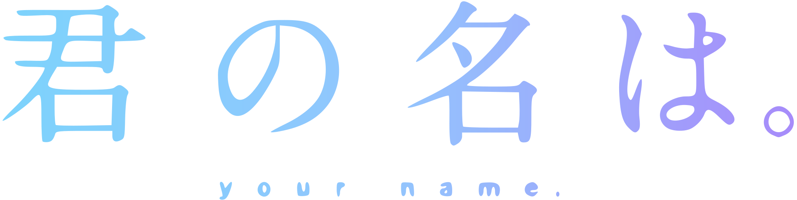
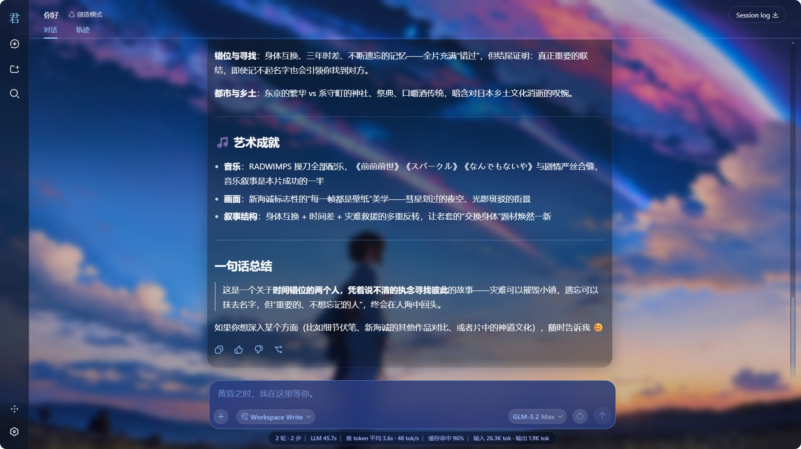
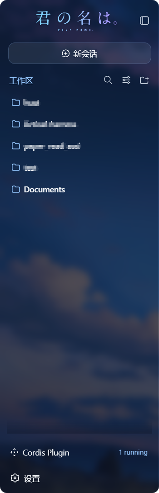

# dsh-kimino-theme · Kimi no Na wa Theme

中文 | [English](README.en.md)

<p align="center">
  
</p>

<p align="center">
  
  &nbsp;
  
  &nbsp;
  
</p>

<p align="center">
  <strong>《你的名字。》(Kimi no Na wa) 主题，为 DeepSeek Harness (DSH) Web GUI 而作</strong><br>
  <em>彗星蓝玻璃拟态 · 电影壁纸 · Logo 替换 · 输入卡重绘 · 统一滚动条 · 对话式一键安装</em>
</p>

<div align="center">

[是什么](#是什么) · [主题细节](#主题细节) · [快速开始](#快速开始) · [自定义](#自定义) · [常见问题](#常见问题) · [已知限制](#已知限制) · [许可证](#许可证与素材版权)

</div>

## 是什么

dsh-kimino-theme 把 DSH Web GUI 变成新海诚《你的名字。》的模样：一张电影壁纸垫底，全部界面表面换成半透明毛玻璃，交互色统一为彗星蓝（`#93C5FD`），侧边栏品牌与首页标题替换为电影 Logo，输入卡重绘为藏蓝玻璃胶囊，占位文案换成「黄昏之时，我在这里等你。」。

它以动态 Cordis 插件形态交付：把一段安装指令粘贴给 DSH 会话中的 Agent 即完成安装，不修改任何 DSH 源码，也不往 profile 里装包；停用/卸载后页面完全还原。

> v65 回归 v59 验证过的动态插件安装方式（v64 曾引入 `dsh plugin add` 静态 bundle 安装，在部分环境下浏览器半区不加载）；主题内容沿用 v64 全量——消息滚动重构、统计栏胶囊、Cordis 面板样式等都在。

| 维度 | 原生 dsh web | dsh-kimino-theme |
| --- | --- | --- |
| 背景 | 纯色 / 纯色渐变 | 电影壁纸 + 全局模糊遮罩 |
| 界面表面 | 不透明分层 | 半透明毛玻璃（backdrop-filter） |
| 品牌标识 | DSH 默认 | 电影 Logo（展开态 + 折叠态） |
| 输入卡 | 默认样式 | 藏蓝玻璃卡片，占位文案主题化 |
| 滚动条 | 默认 | 全局蓝紫玻璃细滚动条 |
| 消息列底部 | 直切 | 40px 渐变淡出蒙版 |
| 安装 | — | 一段指令粘贴给 Agent，自动完成 |
| 还原 | — | `cordis_stop` / `cordis_undefine` 完全还原 |



## 主题细节

### 彗星蓝玻璃拟态

主题通过官方 `theme.overrideTokens` API 叠加一层约 60 项的 design token 覆盖：背景层全部半透明化（露出壁纸）、边框换成低饱和蓝描边、交互态（悬停/激活/选中）统一为彗星蓝系、状态色（错误/成功/警告）微调至与深色玻璃协调。亮色与暗色模式共用同一套视觉——壁纸底上的玻璃拟态本身不区分明暗。完整 token 清单见 [docs/theme-tokens.md](docs/theme-tokens.md)。

### 壁纸与 Logo

- 壁纸由插件宿主半区以 `/kimino-bg/current.jpg` 路由提供（克隆目录的 `assets/current.jpg`），叠加一层轻微的深色渐变保证文字可读性；
- 侧边栏展开态显示横向电影 Logo，折叠态显示字母标记（两个 SVG，同样由插件路由提供）；
- 首页（hero）标题替换为居中大尺寸 Logo。



### 输入卡与占位文案

输入卡重绘为藏蓝（`rgba(37,58,125,*)`）玻璃胶囊：圆角 20px、20px 背景模糊、蓝色描边；会话统计栏变成居中的细胶囊。占位文案替换为：

- 输入框：`黄昏之时，我在这里等你。`
- 新会话描述：`君の名は。想构建怎样的世界？`

中英文界面均替换。

### 消息滚动与渐变蒙版

DSH 的会话滚动容器同时包含消息区和输入框（sticky 吸底），直接加蒙版会裁到输入框。主题把滚动视口下沉到纯消息容器：消息列最后 40px 平滑淡出、输入框零裁切；配套的滚动事件接力修复了「回到底部」按钮在内层滚动器下不出现的问题；输入卡聚焦时的滚轮隔离防止壁纸层跟着滚动。

### 统一滚动条

全局滚动条统一为蓝紫玻璃风格：10px 宽、圆角、半透明蓝拇指（悬停加深），同时适配 WebKit/Blink 与 Firefox 标准属性。

## 快速开始

### 一句话安装（推荐）

把下面整段复制粘贴给 DSH 会话中的 Agent，它会完成克隆、路径改写、插件定义与激活：

```text
请为我安装 DSH 主题插件 dsh-kimino-theme（动态插件方式）：
1. 将 https://github.com/niiang/dsh-kimino-theme 克隆到
   ~/.dsh/themes/dsh-kimino-theme（目录不存在则创建；已存在则先 git pull）。
2. 读取克隆中的 plugin/host.js 与 plugin/client.js。
3. 将 host.js 顶部 bgFile / logoFile / letterFile 三个常量中的
   <CLONE_DIR> 占位符改写为该克隆目录的绝对路径（Windows 注意反斜杠
   转义为 \\），不得保留占位符。
4. 以这两段代码为 code.host / code.client 调用 cordis_define：若名为
   Kimi no Na wa Theme 的插件已存在，向同一 pluginId 追加新 Package 并
   cordis_run mode:"update"；否则新建插件（idPrefix 用 "kimino"）并
   cordis_run mode:"run"。
5. 完成后提醒我 Ctrl+F5 强制刷新浏览器。
```

素材直接取自克隆目录，无需复制到其他位置；主题更新后重跑上面这段即可同步。

### 手动安装

```bash
git clone https://github.com/niiang/dsh-kimino-theme ~/.dsh/themes/dsh-kimino-theme
```

1. 打开 `plugin/host.js`，把顶部三个常量里的 `<CLONE_DIR>` 改成本机克隆目录的绝对路径：

   ```js
   // Linux / macOS
   const bgFile = '/home/you/.dsh/themes/dsh-kimino-theme/assets/current.jpg';
   const logoFile = '/home/you/.dsh/themes/dsh-kimino-theme/assets/logo/your-name-movie-logo-blue.svg';
   const letterFile = '/home/you/.dsh/themes/dsh-kimino-theme/assets/logo/logo-letter.svg';

   // Windows（注意反斜杠转义）
   const bgFile = 'C:\\Users\\you\\.dsh\\themes\\dsh-kimino-theme\\assets\\current.jpg';
   const logoFile = 'C:\\Users\\you\\.dsh\\themes\\dsh-kimino-theme\\assets\\logo\\your-name-movie-logo-blue.svg';
   const letterFile = 'C:\\Users\\you\\.dsh\\themes\\dsh-kimino-theme\\assets\\logo\\logo-letter.svg';
   ```

2. 在 DSH 会话中调用 `cordis_define`：`code.host` 为 `plugin/host.js` 的内容，`code.client` 为 `plugin/client.js` 的内容（新插件，idPrefix 用 `"kimino"`）。
3. `cordis_run` 激活（首次 `mode: "run"`，之后 `mode: "update"`）。
4. 浏览器 **Ctrl + F5** 强制刷新。

### 开机自恢复（可选）

动态插件是进程级的：DSH 重启后主题会消失，重跑安装即可恢复。想免手动，用仓库自带的自恢复伴随插件：

1. 把 `companion/kimino-restore.mjs` 复制到 profile 目录（如 `~/.dsh/profiles/web/`）；
2. 把文件顶部的 `THEME_DIR = '<CLONE_DIR>'` 改成克隆目录的绝对路径；
3. 在该目录的 `cordis.patch.yml` 里追加一行：

   ```yaml
   - insert:
       - id: kimino-restore
         name: ./kimino-restore.mjs
   ```

4. 重启 `dsh web`。之后每个新会话创建时，伴随插件自动从克隆目录读取最新源码重建主题——克隆目录 `git pull` 后无需任何操作。

### 更新 / 暂停 / 卸载

| 操作 | 方式 |
| --- | --- |
| 更新 | 克隆目录 `git pull` → 重跑「一句话安装」（或重新 `cordis_define` 后 `cordis_run mode:"update"`） |
| 暂停 | `cordis_stop <pluginId>` |
| 卸载 | `cordis_undefine <pluginId>`；装了伴随插件的一并移除（patch 行 + 文件，重启 DSH） |

## 自定义

### 换壁纸

替换克隆目录中的 `assets/current.jpg`（保持文件名不变），浏览器强刷（Ctrl+F5）即可，无需重新定义插件。任何 16:9 的高清图都合适；仓库默认壁纸约 5MB，路由缓存 1 小时。

### 换 Logo

替换 `assets/logo/your-name-movie-logo-blue.svg`（展开态，建议横向）与 `assets/logo/logo-letter.svg`（折叠态标记，建议方形），强刷生效。

### 调色

全部颜色集中在两处：token 覆盖在 `plugin/client.js` 的 `overrideTokens` 调用里，组件样式在同一文件 `styles.insert` 的样式表字符串里。改完重新 `cordis_define` + `cordis_run mode:"update"` 并强刷。`docs/theme-tokens.md` 有按用途分组的速查表。

## 架构

v65 回归 v59 的动态插件形态：仓库只承载两段「闭包源码」与素材，由 DSH 的动态 Cordis 运行时在会话内定义并激活——不依赖 profile 安装机制，也不修改 DSH 源码。

```
plugin/host.js      # 动态插件宿主半区（Node）：3 个资产路由 /kimino-bg/*（路径安装时改写）
plugin/client.js    # 动态插件浏览器半区：token 覆盖 + 组件样式 + DOM 补丁（styles.insert）
assets/             # 壁纸与 Logo
companion/          # 可选：开机自恢复伴随插件（静态 profile 插件，自动重建动态主题）
```

所有副作用（token 层、样式标签、事件监听、DOM 属性、路由）都注册在插件 fiber 上，`cordis_stop` / `cordis_undefine` 即完全还原。

## 常见问题

<details>
<summary><strong>背景图 / Logo 404？</strong></summary>

A: `plugin/host.js` 顶部的 `<CLONE_DIR>` 占位符没有改写为本机绝对路径，或克隆目录被移动/删除。检查三个常量后重新 `cordis_define` + `cordis_run mode:"update"`，强刷浏览器。

</details>

<details>
<summary><strong>装完激活了，页面没变化？</strong></summary>

A: 确认 `cordis_run` 结果为成功（如需审批先通过）；浏览器 Ctrl+F5 强刷一次；仍不行时在会话里让 Agent 用 `cordis_inspect_self` 查看插件运行状态与诊断信息。

</details>

<details>
<summary><strong>DSH 重启后主题消失？</strong></summary>

A: 动态插件是进程级的，预期行为。重跑「一句话安装」即恢复；想免手动，按「开机自恢复」部署伴随插件。

</details>

<details>
<summary><strong>DSH 升级后样式错乱 / 某些部分没生效？</strong></summary>

A: 主题依赖少量构建期哈希类名（如 `.Md3f7G_*`、`.wSkVaW_*`、`.hHd-Xa_*`，涉及消息滚动、侧边栏品牌、输入卡高亮），DSH 前端升级后哈希可能变化。token 层与大多数样式（基于稳定 data 属性）不受影响；受影响的选择器需对照新版类名更新。欢迎提 issue 附截图。

</details>

<details>
<summary><strong>亮色模式下文字看不清？</strong></summary>

A: 主题按「壁纸上的深色玻璃」设计，亮/暗模式共用同一套视觉。若在亮色模式下觉得整体偏暗，属预期行为；可自行调亮 token 中的玻璃底色（见「自定义 - 调色」）。

</details>

<details>
<summary><strong>和其他皮肤/主题插件能共存吗？</strong></summary>

A: token 层是叠加式的，但视觉上会互相覆盖。建议同一时间只启用一个主题类插件。

</details>

## 已知限制

- 动态插件是进程级的，DSH 重启后需重新激活（可用伴随插件自动化，见「开机自恢复」）。
- 消息滚动重构、侧边栏 Logo 替换、输入卡高亮等处的选择器依赖 DSH 前端构建期哈希类名，DSH 大版本升级后可能需要跟随更新（见常见问题）。
- 主题强制深色玻璃视觉，亮色模式不做单独适配（见常见问题）。
- 壁纸与 Logo 路由缓存 1 小时，替换素材后需强刷浏览器。

## 许可证与素材版权

代码以 [MIT](LICENSE) 授权。

`assets/` 中的壁纸与 Logo 素材源自电影《你的名字。》（君の名は。, Kimi no Na wa, 2016）的宣传物料，版权归 CoMix Wave Films、东宝等原权利方所有。本仓库仅作个人桌面美化之用，不主张任何素材版权，也不从中获利；如权利方提出异议，将立即移除相关素材。

## 参与贡献

- 提交信息遵循 Conventional Commits（如 `feat(client): 修复 xxx`），代码、文档与提交信息不使用 emoji；
- 用户可见的变更请在 PR 中附截图或验证证据；
- 改动主题 token 时同步更新 [docs/theme-tokens.md](docs/theme-tokens.md)。

<div align="center">

**喜欢这个主题？点个 Star。**

[报告问题](https://github.com/niiang/dsh-kimino-theme/issues) · [功能建议](https://github.com/niiang/dsh-kimino-theme/issues)

</div>
