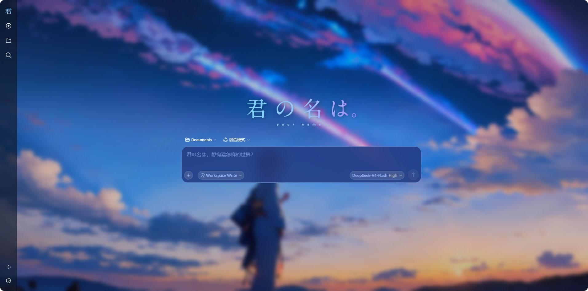

# DSH Kimi no Na wa Theme

《你的名字。》(Your Name / 君の名は。) 主题 —— **DeepSeek Harness (DSH) Web GUI** 的动态 Cordis 插件，把整个界面改造成电影《你的名字。》的深空蓝/彗星蓝风格。

## 效果预览



> 上图：启动后的 Hero 大屏——壁纸背景 + 标题 Logo + 「黄昏之时，我在这里等你。」输入提示。

## 功能特性

- 🖼️ **壁纸背景**：3840×2160 电影场景，叠加暗化渐变 + 毛玻璃模糊
- 🎨 **彗星蓝主题**：62 个设计 token 统一改为深空蓝/彗星蓝体系（`#93C5FD`）
- ⌨️ **输入框**：彗星蓝毛玻璃 `rgba(37,58,125,0.85)`，内部元素 `#98b6fc`，占位文案为原著台词
- 📋 **下拉菜单**：权限选择 / 模型选择 / 供应商分组统一彗星蓝 `rgba(37,58,125,0.94)`
- 📊 **底部统计胶囊**：暗夜暮色 `rgba(20,20,38,0.75)`，紧贴文字、宽度自适应
- 🐟 **Logo 替换**：侧边栏 + Hero 屏换成电影标题 Logo，折叠态显示单字 Logo（`logo-letter.svg`）
- ✨ **细节**：消息卡毛玻璃、菜单深色化、placeholder 文案替换

## 文件结构

```
dsh-kimino-theme/
├── plugin/
│   ├── host.js        # Host 半边——静态资源路由（背景图 / Logo）
│   └── client.js      # Client 半边——token 覆盖 + CSS + placeholder 补丁
├── assets/
│   ├── current.jpg    # 背景壁纸（3840×2160）
│   └── logo/
│       ├── your-name-movie-logo-blue.svg   # 标题 Logo（蓝紫渐变）
│       └── logo-letter.svg                 # 单字裁剪版（折叠态侧栏用）
├── docs/screenshots/
│   └── hero-screen.png                     # Hero 大屏效果图
└── README.md
```

## 安装与使用

DSH 的动态插件通过会话中的 `cordis_define` / `cordis_run` 工具定义并激活。安装分三步：

### 1. 准备资源文件

将本仓库 `assets/` 目录下载到本机（建议放在与仓库同名的目录）：

```
C:\...\kimi-no-na-wa-wallpapers\
├── current.jpg
└── logo\
    ├── your-name-movie-logo-blue.svg
    └── logo-letter.svg
```

### 2. 定义插件包

在 DSH 会话中调用 `cordis_define`，粘贴两份源码：

| 参数 | 值 |
| --- | --- |
| `plugin.kind` | `"existing"` |
| `plugin.pluginId` | `"kimino-6"`（首次可为任意 id，如 `kimino`） |
| `code.host` | `plugin/host.js` 的完整内容 |
| `code.client` | `plugin/client.js` 的完整内容 |
| `name` / `purpose` | 任意描述，如 "Kimi no Na wa Theme" |

> ⚠️ **修改路径**：`host.js` 顶部的 `bgFile` / `logoFile` / `letterFile` 三个变量是**绝对路径**，请按第 1 步实际存放位置修改。

### 3. 激活插件

调用 `cordis_run`：

- 首次：`mode: "run"`，`packageId` 用 `cordis_define` 返回的值；
- 更新版本：`mode: "update"`。

激活后浏览器 **Ctrl+F5** 强制刷新即可看到主题。

### 卸载

在会话中调用 `cordis_stop`（暂停）或 `cordis_undefine`（彻底删除）。

## 常见问题

| 问题 | 解决 |
| --- | --- |
| 背景图/Logo 不显示 | 检查 `host.js` 路径是否匹配本机 `assets/` 位置；刷新时用 Ctrl+F5 |
| 修改源码后不生效 | 每次改动需重新 `cordis_define` 生成新 Package，再 `cordis_run update` |
| 升级后主题异常 | 插件依赖 DSH 构建期 hash 类名（`.hHd-Xa_*` 等），应用升级后需按源码重新核对 |
| 进程重启后主题消失 | 动态插件是进程级的；如需每次启动自动加载，需将插件行加入 host composition（`profiles/web/cordis.patch.yml`）并重启 DSH |

## 版本历史

| 版本 | 说明 |
| --- | --- |
| v57 | 修复输入框右侧滚动条竖线遮挡文字；右侧留白 28px |
| v56 | 折叠态侧栏单字 Logo；下拉菜单彗星蓝；placeholder 原著台词 |
| v51 | 输入框彗星蓝（去紫提亮） |
| v47–v50 | 统计胶囊紧贴文字 |
| v1+ | 基础主题（背景 + token + 毛玻璃 + Logo） |

## 免责声明

- 背景壁纸与标题 Logo 素材版权归原作者所有，请勿用于商业用途，公开使用时建议保留出处。
- 本项目与《你的名字。》官方无任何关联，仅作个人美化用途。
